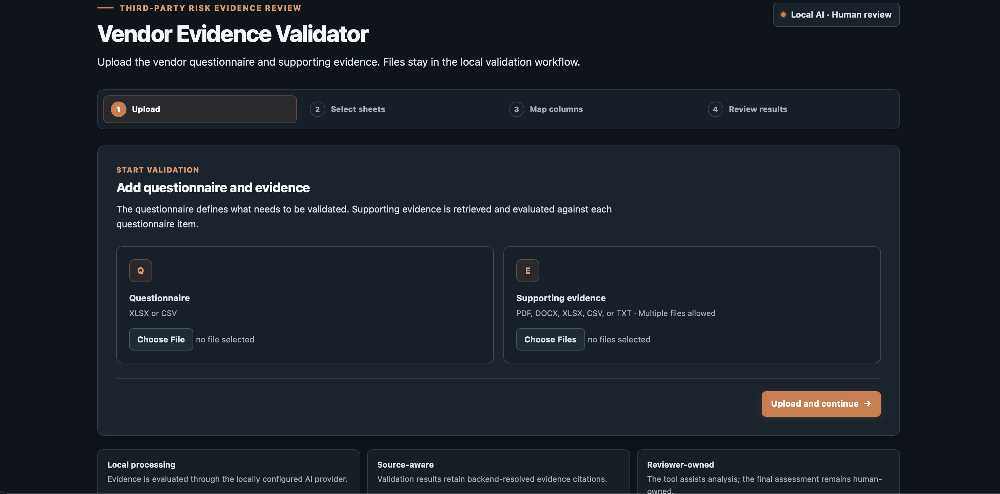
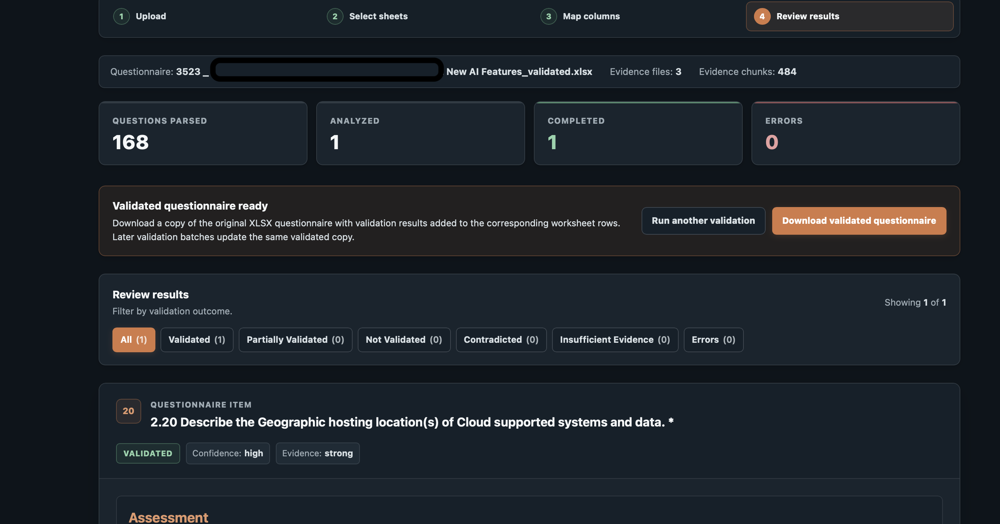
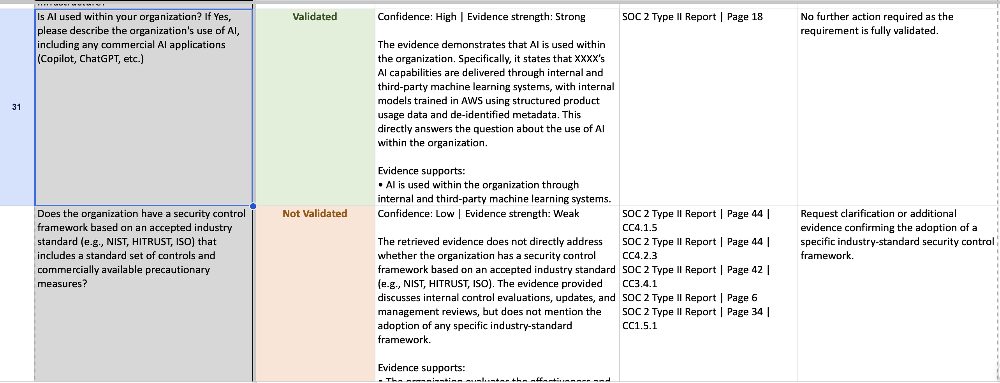

# Vendor Evidence Validator

An AI-assisted third-party risk evidence-validation MVP that evaluates vendor questionnaire requirements against submitted evidence and produces structured, traceable results for human review.

The project addresses a common TPRM problem: a questionnaire response may state that a security control exists, but the response itself is not proof.

When a vendor answer is available, the application treats it as a claim to validate rather than as evidence.

The workflow retrieves relevant submitted evidence, evaluates what that evidence actually demonstrates, validates the AI's structured output, verifies source selections against backend-owned evidence records, resolves reviewer-facing citations, and writes validation results back to the original questionnaire structure.

## Demo

### Upload Workflow

### Validation Results

### Validated Excel Output

*Public demo screenshots must use synthetic or otherwise approved non-confidential data. Real vendor, client, questionnaire, or evidence content should not be published, even when partially redacted.*

## What It Does

For each questionnaire item, the application can:

- retrieve the most relevant submitted evidence
- evaluate the full intent of the questionnaire requirement
- determine a structured validation status
- explain what the evidence supports
- identify what the evidence does not establish
- identify gaps and contradictions
- recommend additional evidence when needed
- provide a reviewer action
- identify the evidence materially relied upon for the assessment
- resolve reviewer-facing citations from backend-owned provenance
- preserve source locations such as PDF page, document section, spreadsheet row, or text line
- write validation results back to the corresponding row in an XLSX questionnaire
- preserve the original questionnaire rather than overwriting it
- support later validation batches that update the same validated workbook
- require human review before a final risk decision

## Validation Statuses

The application uses five validation outcomes:

- `validated`
- `partially_validated`
- `not_validated`
- `contradicted`
- `insufficient_evidence`

The statuses have different evidence requirements and are subject to backend consistency checks.

Examples:

- `validated` requires evidence supporting the complete requirement and valid supporting citations.
- `partially_validated` requires meaningful evidence supporting part of the requirement together with a remaining material gap.
- `not_validated` is used when relevant evidence was reviewed but does not demonstrate a meaningful portion of the required control.
- `contradicted` requires evidence supporting an incompatible or opposite fact.
- `insufficient_evidence` is used when the available evidence is too weak, ambiguous, absent, or insufficiently relevant to determine whether the requirement is met.

The backend rejects structurally inconsistent results rather than accepting the model output without validation.

## Evidence and Citation Model

Evidence provenance is owned by the application backend, not by the language model.

Each extracted evidence chunk receives an internal source ID.

Depending on the file type, backend provenance can include information such as:

- PDF page number
- PDF section or recognized reference identifier when available
- DOCX heading, block, table, and row
- XLSX sheet, row, and cell range
- CSV row
- TXT line range

The language model may reference only source IDs supplied by the retrieval layer.

The backend verifies those references and resolves them back to the original evidence records.

This prevents the model from inventing:

- filenames
- page numbers
- section names
- spreadsheet locations
- source references
- other provenance metadata

Internal source IDs are machine-facing only.

They are used to connect model-selected evidence back to backend provenance but are not displayed in normal reviewer-facing results or exported questionnaire output.

Reviewer-facing citations instead use labels such as:

    Information Security Policy | Page 4 | Access Control

or:

    SOC 2 Type II Report | Page 33 | CC1.4.1

When a reliable section or control identifier is not available, page-level provenance is still retained.

## Retrieval

The retrieval layer combines semantic and lexical search.

Current retrieval uses:

- Sentence Transformers semantic similarity
- TF-IDF lexical similarity
- hybrid scoring to rank evidence relevance

The current scoring mix is:

- 70% semantic similarity
- 30% TF-IDF similarity

The top evidence chunks are retrieved before the language model performs validation.

This means the application is not simply looking for exact keyword matches. Relevant evidence can still be retrieved when the questionnaire wording and evidence wording differ.

## Reviewer-Facing Sources vs Raw Retrieval

The results interface separates two concepts.

### Supporting Sources

Supporting Sources are reviewer-facing citations.

They identify the evidence location materially relied upon for the validation decision without exposing internal source IDs or attempting to reproduce complex document layouts.

### Retrieved Evidence

The expandable retrieved-evidence section is a developer/debug view.

It shows raw chunks returned by the retrieval system together with retrieval scores.

Because PDF text extraction does not always preserve the original visual layout of complex tables or multi-column documents, raw retrieved text may sometimes be difficult to read.

Reviewer-facing validation should rely on the structured assessment and Supporting Sources rather than treating the debug retrieval view as a document preview.

## Questionnaire Workflow

The web workflow supports questionnaires that contain multiple worksheets and different column structures.

The application can:

1. upload a questionnaire and multiple evidence files
2. detect candidate questionnaire worksheets
3. allow the reviewer to select relevant worksheets
4. map questionnaire columns such as:
   - question
   - optional question ID
   - optional vendor answer
   - optional description or context
5. choose a starting question and validation batch size
6. retrieve evidence and run AI-assisted validation
7. review structured results
8. download the validated questionnaire when using XLSX

The application retains the original worksheet and row location for each parsed questionnaire item so validation results can be written back to the correct source row.

## Validated Excel Output

For XLSX questionnaires, the application creates a separate validated workbook rather than overwriting the original questionnaire.

The validated workbook preserves:

- the original workbook
- worksheet structure
- questionnaire questions
- vendor answers
- existing workbook content

The application adds four review columns:

- `Validation Status`
- `Evidence Assessment`
- `Supporting Evidence`
- `Reviewer Action`

Validation results are written to the exact worksheet and source row associated with each questionnaire item.

Later validation batches update the same validated copy, allowing reviewers to validate a questionnaire incrementally without losing earlier results.

The added validation columns use review-oriented formatting while leaving unrelated workbook content unchanged.

Current validated-workbook export supports XLSX questionnaires.

CSV questionnaires can be parsed and validated, but CSV round-trip export is not currently implemented.

## Supported Formats

### Questionnaires

- XLSX
- CSV

### Evidence

- PDF
- DOCX
- XLSX
- CSV
- TXT

The current MVP does not support:

- JPG
- PNG
- screenshots as evidence
- OCR
- image-only or scanned PDFs

Text-based PDFs are supported through PyMuPDF extraction.

## Architecture

The current MVP uses:

- Flask for the web application
- PyMuPDF for PDF extraction
- python-docx for DOCX extraction
- openpyxl and pandas for spreadsheet processing
- Sentence Transformers for semantic retrieval
- TF-IDF for lexical retrieval
- Ollama for local AI inference
- Python validation logic for structured-output consistency
- backend citation resolution for source integrity

The core flow is:

    Questionnaire item
        ↓
    Parse questionnaire context
        ↓
    Retrieve relevant evidence
        ↓
    AI-assisted evidence assessment
        ↓
    Normalize and validate structured result
        ↓
    Verify selected source IDs
        ↓
    Resolve backend-owned provenance
        ↓
    Present reviewer-facing assessment and citations
        ↓
    Write results to validated XLSX
        ↓
    Human reviewer makes the final decision

The language model performs evidence reasoning.

The application backend controls provenance, citation integrity, result consistency, questionnaire row mapping, and workbook export.

## Structured Validation Output

The validation layer currently returns structured fields including:

- status
- confidence
- evidence strength
- explanation
- evidence proved
- evidence not proved
- gaps
- contradictions
- additional evidence needed
- reviewer action
- human review requirement
- source references

Machine-only source references are resolved by the backend before results are presented to reviewers.

## Local AI

The current development configuration uses Ollama with:

    qwen3:14b

AI inference runs locally rather than through an external LLM API.

During the current local configuration, evidence supplied to the model remains within the local inference environment.

Ollama must be installed and running before AI validation can be performed.

The application expects Ollama at:

    http://localhost:11434

The current provider configuration uses deterministic structured-output settings where applicable.

## Setup

Create and activate a Python virtual environment.

Install dependencies:

    pip install -r requirements.txt

Install Ollama separately and pull the configured model:

    ollama pull qwen3:14b

Run the application:

    python app.py

Then open the local Flask URL shown in Terminal.

## Tests

Run the automated test suite with:

    python -m pytest

The automated suite covers areas including:

- validation behavior
- validation status consistency
- citation guardrails
- rejection of unsupported source references
- normalization behavior
- human-facing source-ID cleanup
- key Flask error-handling paths

Additional regression coverage is being added for questionnaire export and cumulative workbook behavior.

The automated tests do not require Ollama unless a test explicitly exercises live model inference.

## Data Safety

The `uploads/` directory is excluded from Git.

Real vendor evidence, questionnaires, client information, confidential assessment data, and other sensitive material should never be committed to the public repository.

Public demonstrations, documentation, test fixtures, and screenshots should use synthetic or otherwise approved non-confidential data only.

The repository is intended to demonstrate the evidence-validation architecture and workflow without publishing real assessment material.

## Current MVP Limitations

The following are intentionally outside the current MVP:

- OCR and scanned-document processing
- image and screenshot evidence
- authentication
- user accounts
- multi-user workflow
- production cloud deployment
- persistent assessment database
- external GRC platform integrations
- vector database
- large-scale asynchronous processing
- automated remediation workflows
- continuous monitoring
- enterprise queueing and concurrency
- CSV questionnaire round-trip export

These are potential product-expansion areas rather than requirements for demonstrating the core evidence-validation workflow.

## Human Review

Vendor evidence is rarely binary, and assessment context matters.

This tool is designed to support a third-party risk reviewer, not replace professional judgment.

The application accelerates evidence retrieval and first-pass analysis, structures the reasoning, identifies gaps and contradictions, and provides traceable source locations.

The final validation, risk interpretation, exception handling, and business decision remain human-owned.